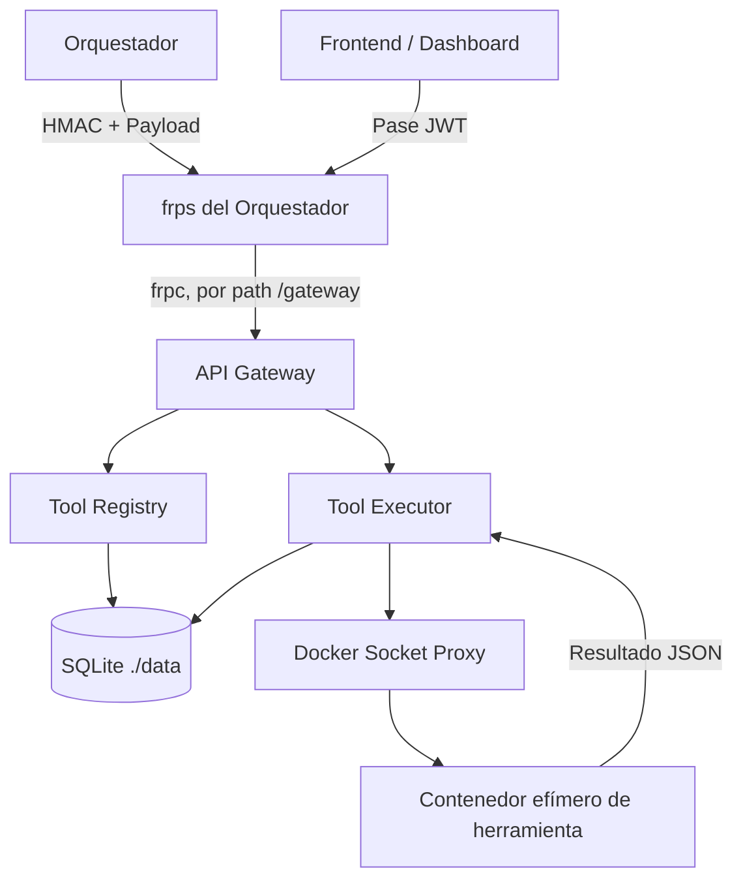

# Documentación Técnica y Arquitectura (eth-runner)

Este documento complementa el [README.md](./README.md) principal y detalla la arquitectura, el flujo de ejecución, la seguridad, la exposición vía frp y las guías de integración para nuevos desarrolladores y para la comunicación con el Orquestador y el Frontend.

## Contenido
1. [Arquitectura y Flujo de Ejecución](#arquitectura-y-flujo-de-ejecución)
2. [Persistencia: SQLite por runner](#persistencia-sqlite-por-runner)
3. [Seguridad y Autenticación Interna (HMAC)](#seguridad-y-autenticación-interna-hmac)
4. [Pase JWT para el Frontend (Dashboard)](#pase-jwt-para-el-frontend-dashboard)
5. [Exposición vía frp y Strip-Prefix Middleware](#exposición-vía-frp-y-strip-prefix-middleware)
6. [Modelo Multi-Tenant y Base de Datos](#modelo-multi-tenant-y-base-de-datos)
7. [Endpoints del API Gateway](#endpoints-del-api-gateway)
8. [Integración de Nuevas Herramientas](#integración-de-nuevas-herramientas)
9. [Pruebas de la API (Ejemplos)](#pruebas-de-la-api-ejemplos)
10. [Instalación y diagnóstico (`instalar_runner.sh`)](#instalación-y-diagnóstico-instalar_runnersh)
11. [Archivos legacy y fuera del flujo soportado](#archivos-legacy-y-fuera-del-flujo-soportado)

---

## Arquitectura y Flujo de Ejecución

El Runner está compuesto por tres microservicios principales (desarrollados en FastAPI) que se comunican entre sí, con el exterior y, opcionalmente, con un frontend de dashboard.



### Flujo de ejecución detallado

1. El orquestador envía una solicitud de ejecución de herramienta al API Gateway (ej. `POST /proxy/ejecutar`), firmada con HMAC.
2. El API Gateway valida la firma HMAC (`X-Signature`) y el `X-Timestamp`.
3. El API Gateway transfiere la petición al **Tool Executor**, firmando también esa llamada interna con HMAC.
4. **Tool Executor** consulta al **Tool Registry** (enviando también firmas HMAC) para obtener la configuración de la herramienta y su versión activa.
5. **Tool Executor** inicia un contenedor Docker efímero utilizando la imagen correspondiente (a través del Docker Socket Proxy para mayor seguridad, sin exponer el socket real).
6. El archivo `run.py` dentro del contenedor recibe los parámetros en JSON, ejecuta la herramienta de ciberseguridad, y captura la salida estándar y de error.
7. El resultado se devuelve como un objeto JSON al Tool Executor, quien lo persiste en la base de datos SQLite local.
8. El contenedor de la herramienta se destruye automáticamente.

Por separado, un frontend de dashboard puede consultar `GET /findings` y `GET /metrics/*` directamente en el API Gateway usando un **pase JWT** (no HMAC) emitido por el orquestador — ver [Pase JWT para el Frontend](#pase-jwt-para-el-frontend-dashboard).

### Ejecución en background y fallback automático de versión

`POST /ejecutar` en el Tool Executor (`tool_executor/app/services/executor_service.py`) no espera a que termine el contenedor: crea el registro de la tarea, la encola con `BackgroundTasks` de FastAPI y devuelve `202`-like (`estado: "pendiente"`) de inmediato. El resultado se consulta después con `GET /proxy/tareas/{tarea_id}` (o `GET /ejecutar/tareas/{tarea_id}` internamente).

Si el contenedor de la versión activa termina con código de salida distinto de cero **y** la herramienta tiene una versión de fallback configurada:
1. Se reintenta la misma ejecución con la imagen de la versión de fallback.
2. Se notifica al Tool Registry (`PUT /herramientas/{nombre}/versiones/{version}/marcar-fallida`, firmado con HMAC) para marcar la versión que falló como `disponible=false` y activar automáticamente la de fallback (`VersionService.marcar_fallida_y_activar_fallback` en `tool_registry`).
3. La tarea persistida queda con `fallback_usado=true` y `version_fallback_id` apuntando a la versión que finalmente se usó.

Esto significa que una versión puede quedar auto-desactivada por una sola ejecución fallida, sin intervención manual — a tener en cuenta al operar el catálogo de herramientas.

`GET /ejecutar/tareas/{tarea_id}` acepta un `usuario_id` opcional por query string: si se pasa, valida que la tarea pertenezca a ese usuario y devuelve `404` (no `403`) si no, para no revelar la existencia de tareas ajenas.

---

## Persistencia: SQLite por runner

Cada runner es dueño de sus propios datos. Ya no existe un servicio de base de datos compartido (PostgreSQL) en el stack: el Gateway, el Registry y el Executor comparten un único archivo SQLite montado como volumen (`./data/runner.db`, `DATABASE_URL=sqlite+aiosqlite:////data/runner.db`).

Puntos importantes:

* **Auto-creación de tablas**: al arrancar, `api_gateway/app/main.py` corre `Base.metadata.create_all` dentro del `lifespan` de FastAPI. No hay sistema de migraciones (tipo Alembic): un cambio de esquema en un modelo existente **no** se aplica solo con esto.
* **`data/*.db` no se versiona**: `create_all()` nunca migra una tabla que ya existe, así que una copia de la base de datos commiteada queda con el esquema viejo para siempre en cuanto cambian los modelos (ya pasó: quedó con `id BIGINT` en vez de `id INTEGER`, rompiendo el autoincrement de SQLite). Si se modifica un modelo y hace falta el esquema nuevo en desarrollo, hay que borrar `data/runner.db` para que se regenere.
* **Auto-sembrado**: el servicio `seeder` (`scripts/seed_db.py`, ver `scripts/Dockerfile.seeder`) corre una sola vez después de que `tool_registry` esté saludable, y registra el catálogo inicial de herramientas firmando sus peticiones con el mismo HMAC.
* **Dueño del archivo**: ningún Dockerfile del proyecto define `USER`, así que los contenedores escriben `./data/runner.db` como root. Después de levantar el stack una vez, borrar o mover ese archivo (o `.env`/`frpc/frpc.toml`, ver [Instalación y diagnóstico](#instalación-y-diagnóstico-instalar_runnersh)) sin `sudo` suele fallar por permisos.

---

## Seguridad y Autenticación Interna (HMAC)

El Runner **no confía en nadie por defecto**. Debido a que tiene permisos para levantar contenedores que ejecutan herramientas de pentesting, su acceso está estrictamente protegido.

Las rutas de servidor a servidor (orquestador ↔ runner, y las llamadas internas entre Gateway/Registry/Executor) están protegidas mediante firmas **HMAC** (Hash-based Message Authentication Code), implementadas en `shared/internal_auth.py`.

En cada petición hacia una ruta protegida por HMAC, se deben generar y enviar los siguientes encabezados:

```http
X-Signature: <firma-hmac-sha256>
X-Timestamp: <unix-timestamp>
Content-Type: application/json
```

### ¿Cómo generar la firma?

La firma se calcula usando la llave compartida `INTERNAL_API_TOKEN` sobre el mensaje concatenado:
`METHOD:PATH:TIMESTAMP:BODY`

* **METHOD**: El método HTTP en mayúsculas (ej. `POST`).
* **PATH**: La ruta relativa de la petición **tal como la vería quien firma**, incluyendo el prefijo de frp si aplica (ej. `/gateway/proxy/ejecutar` cuando se llama desde afuera vía frp, `/proxy/ejecutar` para llamadas internas por la red de Docker). Ver [Exposición vía frp](#exposición-vía-frp-y-strip-prefix-middleware).
* **TIMESTAMP**: El tiempo actual en formato UNIX timestamp entero.
* **BODY**: El cuerpo de la petición en formato JSON stringificado. Si no hay cuerpo (ej. un `GET`), esta parte se deja en blanco, pero los separadores `:` se mantienen.

Si la firma es inválida, el timestamp supera la ventana de tolerancia (5 minutos), o faltan los encabezados, la petición será rechazada con un error HTTP 401.

`INTERNAL_API_TOKEN` es obligatorio: si no está configurado, `shared/internal_auth.py` lanza un `ValueError` al importarse y el servicio falla al iniciar (fail-closed) — no hay modo "sin autenticación" ni siquiera en desarrollo.

> [!NOTE]
> Los endpoints `GET /` permanecen públicos para los healthchecks en docker-compose, por lo que no requieren firma. Lo mismo aplica a `GET /findings` y `GET /metrics/*`, que en vez de HMAC exigen el pase JWT descrito a continuación.

---

## Pase JWT para el Frontend (Dashboard)

Los endpoints pensados para ser consumidos directamente por el navegador (`/findings` y `/metrics/*` en el API Gateway, ver `api_gateway/app/core/jwt_auth.py`) **no** usan HMAC: en su lugar exigen un token Bearer JWT ("pase") de corta duración.

* El pase lo emite el **Orquestador** (`GET /runners/{id}/pase`), no el runner.
* Está firmado con el mismo secreto `INTERNAL_API_TOKEN` que comparten runner y orquestador (algoritmo `HS256`).
* Debe incluir el claim `exp`: la validación exige explícitamente su presencia (`options={"require": ["exp"]}`), porque PyJWT solo valida `exp` si está presente, no lo exige por defecto. Un pase sin `exp` sería válido para siempre.
* Si el runner tiene `RUNNER_ID` configurado (lo escribe `instalar_runner.sh` al registrarse), el claim `runner_id` del pase debe coincidir exactamente; de lo contrario se rechaza con 401. Esto evita que un pase emitido para otro runner —pero firmado con el mismo secreto compartido, si se reutilizara por error— sea válido aquí.

```http
GET /findings
Authorization: Bearer <pase-jwt-del-orquestador>
```

> **Importante para quien integre un nuevo endpoint de dashboard**: el pase JWT es intencionalmente débil comparado con HMAC (no firma method/path/body/timestamp de la petición concreta, solo prueba que el orquestador autorizó a este navegador a ver datos de este runner). El router `proxy.py` (ejecución de herramientas y gestión de catálogo) exige HMAC a propósito y **no** acepta el pase JWT — no debe alcanzar a la ejecución de herramientas.

---

## Exposición vía frp y Strip-Prefix Middleware

El Runner ya no publica puertos directamente al exterior. En su lugar, corre un cliente `frpc` (`docker-compose.yml`, imagen `snowdreamtech/frpc`) que abre una conexión saliente hacia el `frps` del orquestador y expone los tres servicios bajo un mismo subdominio del cliente, distinguidos por **path**:

| Proxy frp   | Path público   | Servicio interno            |
| ----------- | -------------- | ---------------------------- |
| `gateway`   | `/gateway`     | `runner-api-gateway:8000`    |
| `registry`  | `/registry`    | `runner-tool-registry:8003`  |
| `executor`  | `/executor`    | `runner-tool-executor:8004`  |

frp enruta por ese path pero **no lo reescribe**: la petición le llega al servicio con el prefijo incluido (ej. `/gateway/findings` en vez de `/findings`). Para que FastAPI siga matcheando rutas sin prefijo y la firma HMAC se calcule sobre el path público real, cada servicio monta `StripPrefixMiddleware` (`shared/prefix_middleware.py`) configurado con `URL_PREFIX` (`/gateway`, `/registry` o `/executor` según el servicio, ver `docker-compose.yml`):

* Separa el prefijo del `path` del scope ASGI, moviéndolo a `root_path`.
* `shared/internal_auth.py` reconstruye el path firmado como `root_path + path`, para que la firma calculada del lado del orquestador (que sí conoce el prefijo) coincida.
* Es deliberadamente una clase ASGI simple, no `BaseHTTPMiddleware` ni el `root_path=` nativo de FastAPI/Starlette.
* El prefijo es opcional: las llamadas internas entre servicios (por la red de Docker, sin pasar por frp) no lo traen y siguen funcionando igual.

La autenticación de frp en sí (quién puede registrar un proxy) se resuelve con dos capas:
1. `[auth] method = "token"` en `frpc.toml`: token compartido de frp, el mismo para todos los runners del `frps`.
2. `metadatas` **por proxy** (`runner_id` y `token` = `INTERNAL_API_TOKEN` de este runner) en cada bloque `[[proxies]]`: el plugin del `frps` del orquestador valida esto en el evento `NewProxy`, no alcanza con ponerlo solo en `[metadatas]` a nivel de cliente. `frpc/frpc.toml.example` repite estos valores en ambos lugares por esta razón.

`frpc/frpc.toml` (el archivo real, no el `.example`) está en `.gitignore`: contiene el token del `frps` y el `INTERNAL_API_TOKEN` del runner. Lo genera `scripts/instalar_runner.sh` a partir de la plantilla; no se edita a mano ni se commitea.

---

## Modelo Multi-Tenant y Base de Datos

El Runner implementa aislamiento lógico de los datos. No fue concebido para que clientes finales ataquen directamente a la API del runner, sino que el orquestador es quien representa a los clientes.

### Estructura de pertenencia

```text
Orquestador (ID de usuario externo)
    └── usuarios (en SQLite del Runner, identificados por external_id)
        ├── objetivos (usuario_id → usuarios.id)
        └── sesiones_escaneo (id_usuario → usuarios.id)
            └── tareas_escaneo (sesion_id) → resultados_tareas
```

Importante: **la sesión no guarda a qué objetivo pertenece.** `POST /sesiones` recibe `objetivo_id`, pero solo lo usa una vez para resolver el `usuario_id` del objetivo (`SesionService.crear_sesion`); la tabla `sesiones_escaneo` únicamente tiene `id_usuario`, no `objetivo_id`. Es decir: `objetivos` y `sesiones_escaneo` son ambas hijas directas de `usuarios`, no una cadena `objetivo → sesión`. Si en el futuro hace falta saber sobre qué objetivo corrió una sesión, hay que agregar esa columna explícitamente.

El orquestador debe sincronizar los usuarios usando `POST /usuarios` (idempotente por `external_id`) y pasar los IDs correspondientes cuando lanza un escaneo.
* El Runner asume que la autorización para escanear un objetivo ya fue validada por el Orquestador.
* `email` es opcional (`None` por defecto) y no un placeholder fijo: la columna es `nullable` y `UNIQUE`, así que un valor compartido entre dos usuarios sin correo rompería la unicidad en cuanto hubiera un segundo caso. `password_hash` es obligatorio en el modelo pero no se usa para login: los tenants creados desde el orquestador no inician sesión en el runner, así que se guarda el placeholder no utilizable `"SUPABASE_AUTH"` (`UsuarioRepository.crear`).
* `DEFAULT_PROXY_USER_ID` solo lo usa el flujo de auto-creación de sesión en `POST /proxy/ejecutar` cuando llega una ejecución sin `sesion_id`; el orquestador no depende de este flujo porque crea su propio usuario/sesión por tenant explícitamente vía `/usuarios`, `/objetivos` y `/sesiones`.
* `scripts/migrations/001_multi_tenant.sql` es un resabio de cuando la base era PostgreSQL/Supabase (agregaba `external_id` a una tabla `usuarios` preexistente a mano). Con SQLite y `Base.metadata.create_all`, la columna ya nace en el modelo (`shared/database/models/usuarios.py`) y no hace falta correr esa migración: queda solo como referencia histórica. Lo mismo aplica al docstring de ese modelo, que todavía describe el escenario de Supabase.

---

## Endpoints del API Gateway

| Endpoint                     | Método | Autenticación | Propósito |
| ----------------------------- | ------ | -------------- | --------- |
| `/`                           | GET    | Ninguna        | Healthcheck. |
| `/proxy/*`                    | *      | HMAC           | Proxy hacia Tool Registry y Tool Executor: catálogo de herramientas, versiones y ejecución (`/proxy/ejecutar`). Solo lo usa el orquestador. |
| `/usuarios`                   | POST   | HMAC           | Alta idempotente de usuario por `external_id`. |
| `/objetivos`                  | POST   | HMAC           | Alta de objetivo asociado a un usuario. |
| `/sesiones`                   | POST   | HMAC           | Alta de sesión de escaneo (recibe `objetivo_id` solo para resolver el usuario dueño; ver nota abajo). |
| `/findings`, `/findings/{id}` | GET    | Pase JWT       | Listado y detalle de hallazgos, para el dashboard del frontend. |
| `/metrics/risk-score`         | GET    | Pase JWT       | CVSS promedio de todos los hallazgos. |
| `/metrics/quick-stats`        | GET    | Pase JWT       | Conteo de hallazgos críticos/altos abiertos y resueltos. |
| `/metrics/heatmap`            | GET    | Pase JWT       | Hallazgos agrupados por categoría/tab/severidad. |
| `/metrics/patch-progress`     | GET    | Pase JWT       | Progreso de resolución de hallazgos, global y por severidad. |

---

## Integración de Nuevas Herramientas

Cada herramienta de escaneo corre en su propia imagen de Docker para aislar dependencias. El catálogo actual incluye utilidades básicas (`curl`, `ls`, `cat`, usadas también para pruebas del flujo) y herramientas de seguridad (`nmap`, `sqlmap`, `nuclei`, `xsstrike`, `gobuster`, `nikto`, `hydra`, `radare2`, `osquery`, `trivy`, `wapiti`). Para agregar una herramienta nueva, sigue estos pasos:

### 1. Crear el entorno de la herramienta
Crea un directorio en `tools/nueva_herramienta/` que contenga un `Dockerfile` y un archivo `run.py`.

### 2. Crear el Dockerfile
Debe instalar la herramienta de ciberseguridad por línea de comandos y definir el punto de entrada.

```dockerfile
FROM alpine:latest
RUN apk add --no-cache python3 nmap
WORKDIR /app
COPY run.py /app/run.py
ENTRYPOINT ["python3", "/app/run.py"]
```

### 3. Crear el adaptador `run.py`
El adaptador debe leer un JSON entrante con la configuración dictada por el orquestador, ejecutar el comando, y devolver una salida estándar en JSON.

```python
import json, sys, subprocess

def main():
    try:
        input_data = sys.argv[1] if len(sys.argv) > 1 else sys.stdin.read()
        params = json.loads(input_data)
        objetivo = params.get("objetivo", "127.0.0.1")

        comando = ["nmap", objetivo]
        proceso = subprocess.run(comando, capture_output=True, text=True, check=False)

        print(json.dumps({
            "error": None,
            "resultado": {"raw_output": proceso.stdout + proceso.stderr},
            "codigo_salida": proceso.returncode,
        }))
    except Exception as exc:
        print(json.dumps({"error": str(exc), "resultado": None, "codigo_salida": 1}))

if __name__ == "__main__":
    main()
```
> **Advertencia**: No utilices `shell=True` al llamar a `subprocess.run` para evitar inyecciones de comandos en caso de que el orquestador envíe payloads maliciosos por accidente.

### 4. Agregar a docker-compose y registrarla
Deberás agregar la herramienta en `docker-compose.yml` (bajo el formato `tool_nuevaherramienta`, con `image: backend_runner-nuevaherramienta`) e incluirla en el diccionario `HERRAMIENTAS` de `scripts/seed_db.py`, que la registra automáticamente al arrancar el stack.

---

## Pruebas de la API (Ejemplos)

El siguiente script en Python demuestra cómo el orquestador (o tú mismo) puede construir la firma HMAC y lanzar una ejecución.

```python
import time
import hmac
import hashlib
import json
import requests

API_URL = "http://localhost:8002"  # o la URL pública vía frp, ej. https://cliente-acme.runners.dani27001.com/gateway
SECRET = "my-super-secret-token"  # Reemplazar por tu INTERNAL_API_TOKEN

def get_signed_headers(method, path, body=""):
    timestamp = str(int(time.time()))
    msg = f"{method}:{path}:{timestamp}:{body}"
    signature = hmac.new(SECRET.encode(), msg.encode(), hashlib.sha256).hexdigest()
    
    return {
        "X-Signature": signature,
        "X-Timestamp": timestamp,
        "Content-Type": "application/json"
    }

# 1. Ejecutar una tarea (ej. nmap)
# Nota: si se llama vía frp, el path a firmar debe incluir el prefijo del proxy
# (ej. "/gateway/proxy/ejecutar"), porque es el path público que ve el runner.
path = "/proxy/ejecutar"
payload = {
  "herramienta": "nmap",
  "params": {
    "objetivo": "scanme.nmap.org",
    "tipo_escaneo": "-sV"
  },
  "sesion_id": 1,
  "orden_ejecucion": 1
}
body_str = json.dumps(payload, separators=(',', ':'))

headers = get_signed_headers("POST", path, body_str)
response = requests.post(f"{API_URL}{path}", headers=headers, data=body_str)

print("Tarea Iniciada:", response.json())
```

Para consultar hallazgos o métricas desde un frontend, se usa un pase JWT en vez de HMAC:

```python
import requests

API_URL = "https://cliente-acme.runners.dani27001.com/gateway"
PASE_JWT = "..."  # obtenido del orquestador vía GET /runners/{id}/pase

response = requests.get(f"{API_URL}/findings", headers={"Authorization": f"Bearer {PASE_JWT}"})
print(response.json())
```

---

## Instalación y diagnóstico (`instalar_runner.sh`)

`scripts/instalar_runner.sh` es un CLI en bash puro (sin dependencias de Python en el host) pensado para condensar en un solo comando lo que antes eran pasos manuales sueltos: registro en el orquestador, edición de `.env`, generación de `frpc.toml`, `docker compose up` y diagnóstico.

> **Requiere `sudo`.** La razón principal no es Docker: ningún Dockerfile del proyecto define `USER`, así que los contenedores corren como root y escriben `data/runner.db` con ese dueño; en cuanto el stack se levantó una vez, `.env` y `frpc/frpc.toml` también suelen terminar con permisos que un usuario normal no puede modificar. A eso se suma que `docker compose` necesita el socket de Docker, al que tampoco se accede sin `sudo` si el usuario no pertenece al grupo `docker` — aunque este segundo punto por sí solo no era limitante en nuestros despliegues. El script valida ambas cosas al arrancar (`verificar_permisos`: prueba de escritura sobre `.env`/`frpc.toml` y `docker info`) y corta con un mensaje explícito si falta `sudo`, en vez de fallar más adelante con un error de escritura o un `permission denied` de Docker a mitad de la instalación o el diagnóstico.

**Qué NO cubre este CLI todavía** — es solo instalación + diagnóstico, no un ciclo de vida completo. No hay comandos para:
* Reiniciar el stack (usar `docker compose restart` / `down` + `up` a mano, con `sudo`).
* Actualizar un runner ya instalado a una versión nueva del código (`git pull` + `docker compose up -d --build`, a mano).
* Desregistrar o dar de baja un runner del lado del orquestador.
* Rotar `INTERNAL_API_TOKEN` sin volver a canjear un código de activación nuevo.

Si se necesita alguna de estas operaciones con frecuencia, vale la pena agregarle un subcomando al script en vez de resolverlo a mano cada vez.

Pasos que ejecuta en una instalación completa:

1. **Registro**: `POST {orquestador-url}/runners/registrar` con el código de activación y las URLs públicas (`https://{slug}.{dominio}/gateway`, `.../registry`, `.../executor`). El orquestador responde con `runner_id` e `internal_token`.
   * Es seguro de reintentar: si `.env` ya tiene `RUNNER_ID`/`INTERNAL_API_TOKEN`, se saltea este paso y reutiliza esas credenciales (el código de activación es de un solo uso).
2. **Actualiza `.env`**: escribe `INTERNAL_API_TOKEN` y `RUNNER_ID` preservando el resto del archivo (sin `sed`, para no tener que escapar caracteres especiales de tokens en base64).
3. **Genera `frpc/frpc.toml`**: reemplaza los placeholders de `frpc/frpc.toml.example` con los valores de `--frp-server-addr`, `--frp-token`, `--slug`, y las credenciales obtenidas en el registro.
4. **Levanta el stack**: `docker compose up -d --build` (salvo que se pase `--no-up`).
5. **Diagnostica** (también disponible solo, con `--solo-diagnostico`):
   * Verifica que gateway/registry/executor respondan `200` en su healthcheck **desde dentro** de cada contenedor (sin pasar por frp).
   * Revisa los logs de `frpc` buscando confirmaciones de `start proxy success` por cada proxy, o errores conocidos (token de frp incorrecto, proxy rechazado, sin logs todavía).

Ver `scripts/instalar_runner.sh --help` para el listado completo de flags.

---

## Archivos legacy y fuera del flujo soportado

El repositorio conserva algunos archivos de generaciones anteriores del proyecto (pre-frp / pre-SQLite) que no forman parte del flujo actual. Se documentan aquí para que no se confundan con la forma soportada de operar el runner:

* **`scripts/registrar_runner.py`**, **`scripts/test_runner_endpoints.py`**, **`scripts/init_db.py`**: CLI de registro y utilidades en Python de antes de `scripts/instalar_runner.sh`. No conocen frp ni el prefijo de path (asumen URLs públicas directas por servicio, como el README viejo). `instalar_runner.sh` los reemplaza para instalación/registro; quedan como referencia o para debugging puntual contra HMAC.
* **`scripts/start-dev.ps1`**: archivo vacío.
* **`scripts/migrations/001_multi_tenant.sql`**: migración manual para la época de PostgreSQL/Supabase, ver la nota en [Modelo Multi-Tenant](#modelo-multi-tenant-y-base-de-datos). No aplica con SQLite + `create_all`.
* **`setup.ps1`** (raíz del repo): script de arranque para Windows que referencia puertos publicados en el host (`8002`-`8004`) y solo 4 imágenes de herramientas (`nmap`, `sqlmap`, `nuclei`, `xsstrike`). Ambos supuestos quedaron desactualizados: ya no se publican puertos al host y el catálogo de herramientas creció (ver [Integración de Nuevas Herramientas](#integración-de-nuevas-herramientas)).
* **`openvas_stack/compose.yaml`**: un stack completo de Greenbone Community Edition (OpenVAS) standalone, no referenciado desde `docker-compose.yml` ni desde ningún servicio del runner, y sin una herramienta `tools/openvas/` correspondiente en el catálogo. Parece preparación para una integración futura, pendiente de conectar con el Tool Registry/Executor.

Si vas a tocar alguno de estos archivos, conviene primero confirmar si siguen teniendo un propósito vigente o si ya pueden eliminarse.
