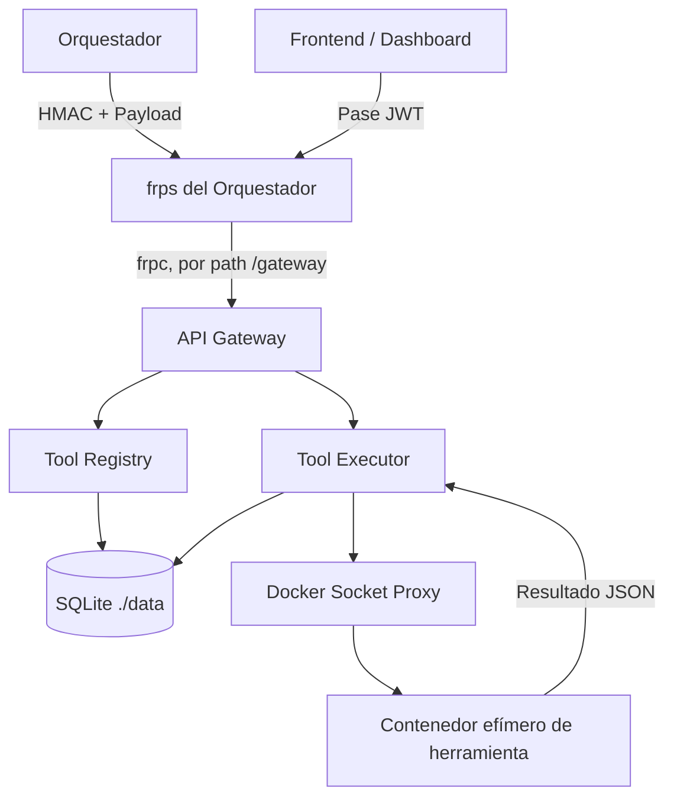

# Dani-ETH — eth-runner

**eth-runner** es el backend modular encargado de registrar, versionar y ejecutar herramientas de evaluación de seguridad (Nmap, Nuclei, SQLMap, Hydra, entre otras) dentro de contenedores Docker efímeros y aislados. Es el módulo "motor de ejecución" de **Dani-ETH**, la plataforma de ethical hacking automatizado desarrollada para **Alloxentric**.

> ⚠️ **Aviso de uso ético y legal**
> Este software fue desarrollado con fines académicos y de auditoría defensiva. Debe utilizarse exclusivamente sobre infraestructura propia, laboratorios controlados o activos donde se cuente con autorización formal y explícita por escrito.

---

## Descripción

### ¿Qué hace?
El Runner opera bajo el modelo de **"trabajador ciego"** (*blind worker*): recibe órdenes remotas y firmadas desde un **Orquestador central**, aprovisiona contenedores Docker descartables para ejecutar la herramienta de seguridad solicitada (a través de un Docker Socket Proxy, sin exponer el socket real del host), captura y estructura los hallazgos, y los devuelve. Cada contenedor de herramienta se destruye automáticamente al terminar, por lo que el Runner no conserva estado ni persistencia maliciosa entre ejecuciones. Toda la comunicación de servidor a servidor está firmada con HMAC-SHA256, y el acceso del frontend/dashboard se hace con un pase JWT de corta duración; el Runner se expone al exterior únicamente a través de un túnel reverso `frpc`, sin publicar puertos en la red local.

### ¿A quién va dirigido?
A **Alloxentric**, como componente interno de su plataforma Dani-ETH. No está pensado para que un cliente final interactúe directamente con la API del Runner: es el Orquestador quien representa y autentica a cada cliente (tenant), y quien autoriza qué objetivos pueden escanearse.

### ¿Qué problema resuelve?
Las pruebas de penetración (pentesting) tradicionales son esporádicas, costosas y dependen de especialistas humanos escasos, lo que deja ventanas prolongadas de vulnerabilidad sin detectar. Dani-ETH busca democratizar el pentesting mediante vigilancia continua y automatización; **eth-runner** es la pieza que ejecuta de forma segura y aislada las herramientas de seguridad reales (Nmap, Nuclei, SQLMap, etc.) sobre los objetivos autorizados, y entrega resultados estructurados y consistentes para que el Orquestador y el módulo de IA generen reportes y alertas.

---

## Tecnologías utilizadas

* **Lenguajes:** Python 3.11+, Bash (scripts de automatización e instalación).
* **Frameworks y librerías backend:**
  * FastAPI — API Gateway y microservicios asíncronos.
  * SQLAlchemy + AioSQLite — ORM asíncrono.
  * Pydantic v2 — validación y tipado de esquemas.
  * HTTPX — cliente HTTP asíncrono para comunicación interna y con el orquestador.
* **Base de datos:** SQLite local persistida sobre volumen montado (`./data/runner.db`), un archivo por runner (sin servidor de base de datos externo).
* **Contenedores y virtualización:**
  * Docker Engine / Docker Compose (Compose v2).
  * Docker Socket Proxy (`tecnativa/docker-socket-proxy`) para encapsular y restringir las llamadas a la API de Docker.
* **Redes y conectividad:** frp (*Fast Reverse Proxy*, cliente `frpc`) para exponer el Runner por túnel reverso saliente, sin abrir puertos públicos.
* **Seguridad:** firmas HMAC-SHA256 para comunicación servidor-a-servidor, JWT (HS256) para el pase de solo lectura del dashboard.
* **Herramientas de pentesting integradas:** Nmap, Nuclei, SQLMap, XSStrike, Gobuster, Nikto, Hydra, Radare2, OSQuery, Trivy, Wapiti (además de `curl`/`ls`/`cat` como utilidades de prueba del flujo).

---

## Instrucciones para ejecutar el proyecto localmente

### Requisitos previos
* Git.
* Docker Desktop (contenedores Linux) o Docker Engine + Docker Compose v2.
* bash y curl.
* Acceso `sudo` en la máquina (los contenedores corren como root y escriben `./data`, `.env` y `frpc/frpc.toml` con ese dueño).

No necesitas instalar una base de datos: SQLite se crea automáticamente sobre el volumen `./data`.

### Opción A — Desarrollo local (sin exponer nada por frp)

```bash
# 1. Clonar y entrar al repo
git clone <url-del-repo>
cd eth-runner

# 2. Configurar variables de entorno
cp .env.example .env
# Completa INTERNAL_API_TOKEN con cualquier valor en desarrollo
# (en producción lo entrega el registro contra el Orquestador)

# 3. Levantar el stack, omitiendo frpc (no hace falta en local)
sudo docker compose up -d --build $(docker compose config --services | grep -v '^frpc$')

# 4. Verificar que los servicios estén arriba
sudo docker compose ps
```

Ningún servicio publica puertos al host por defecto, así que para probar los endpoints en local se entra por la red de Docker:

```bash
sudo docker compose exec api_gateway curl http://localhost:8000/
```

### Opción B — Instalación completa con registro y exposición por frp

Pensada para un despliegue real conectado a un Orquestador, usando el CLI incluido:

```bash
sudo scripts/instalar_runner.sh \
  --orquestador-url https://api.orquestador.com \
  --codigo ABC123 \
  --nombre produccion \
  --slug cliente-acme \
  --frp-server-addr <IP_DEL_FRPS> \
  --frp-token <TOKEN_FRP>
```

Este script registra el Runner en el Orquestador, completa `.env`, genera `frpc/frpc.toml`, levanta `docker compose up -d --build` y corre un diagnóstico de conectividad. Ver `scripts/instalar_runner.sh --help` para todas las opciones, y [`ARCHITECTURE.md`](./ARCHITECTURE.md) para el detalle de cada pieza.

### Comandos útiles

```bash
docker compose logs -f              # logs en tiempo real
docker compose logs -f frpc         # logs de la conexión con el orquestador
docker compose up --build -d api_gateway   # reconstruir un solo servicio
docker compose down                 # apagar todo
```

---

## Integrantes del equipo

Equipo de 3 personas a cargo de **eth-runner** (backend y motor de ejecución de Dani-ETH):

| Integrante | Rol | Fortalezas / área de aporte |
| --- | --- | --- |
| **Sebastián Carrasco** | Líder del equipo · Backend Developer (Seguridad & Testing) | Testeo de ciberseguridad e implementaciones; toma las decisiones del equipo y lidera la comunicación con el equipo encargado del Orquestador. |
| **Lucas Arcos** | Backend Developer (Datos & Automatización) | Bases de datos y automatización de procesos. |
| **Luis Orellana** | Backend Developer (Programación & Diseño) | Programación y diseño de la solución. |

---

## Metodología de trabajo

El equipo trabaja bajo la metodología ágil **Scrum**, en un ciclo de **12 semanas dividido en 6 Sprints de 2 semanas** cada uno. La estimación de tareas se hace con **Story Points** (escala de Fibonacci).

**Ceremonias:** Sprint Planning (2h), Daily Standup (15min), Sprint Review (1h), Sprint Retrospective (1h) y Backlog Refinement (1h).

**Definition of Done (DoD):** cada historia de usuario debe cumplir, antes de darse por terminada:
* Código revisado por pares (peer review) — ningún PR llega a `main` sin aprobación cruzada.
* Cobertura de pruebas unitarias superior al 80%.
* Pruebas de integración pasando en verde.
* Documentación actualizada.
* Despliegue exitoso en ambiente de staging.
* Aprobación de QA y aceptación final del Product Owner.

La integración con el equipo Frontend & IA se coordina mediante un enfoque **API-first**: los contratos de esquemas JSON (entrada/salida) se acuerdan y versionan antes de codificar, para evitar bloqueos cruzados entre equipos.

---

## Arquitectura de la solución

El Runner está compuesto por tres microservicios en FastAPI (API Gateway, Tool Registry y Tool Executor) que comparten una única base SQLite y se comunican entre sí y con el exterior de forma securizada. No publica puertos directos: toda entrada pasa por un túnel reverso `frpc` hacia el `frps` del Orquestador.



**Flujo resumido:**
1. El Orquestador envía una orden de ejecución firmada con HMAC al API Gateway (`POST /proxy/ejecutar`).
2. El Gateway valida la firma y reenvía la petición al Tool Executor (también firmada).
3. El Tool Executor consulta al Tool Registry la versión activa de la herramienta solicitada.
4. El Tool Executor levanta un contenedor Docker efímero (vía Docker Socket Proxy) con la imagen de esa herramienta.
5. La herramienta corre dentro del contenedor, devuelve su salida como JSON, y el contenedor se destruye.
6. El resultado se persiste en SQLite y queda disponible para el Orquestador y, mediante un pase JWT, para el dashboard del Frontend (`GET /findings`, `GET /metrics/*`).

Para el detalle completo (autenticación HMAC, pase JWT, modelo multi-tenant, exposición vía frp, cómo integrar una nueva herramienta, etc.) ver [**ARCHITECTURE.md**](./ARCHITECTURE.md).

---

## Servicios

| Servicio | Puerto interno | Rol |
| --- | --- | --- |
| API Gateway | `8000` | Punto de entrada: HMAC para el orquestador, pase JWT para el frontend. |
| Tool Registry | `8003` | Gestión de herramientas y versiones. |
| Tool Executor | `8004` | Lanza contenedores efímeros vía Docker Socket Proxy. |
| Docker Socket Proxy | `2375` | API Docker restringida, sin exponer el socket real. |
| frpc | — | Cliente saliente de frp: expone gateway/registry/executor sin publicar puertos. |
| redis | `6379` | Declarado como dependencia del stack (no usado directamente por el código actual). |

---

*Para dudas técnicas, integración con el Orquestador, el detalle de la exposición vía frp o el modelo de autenticación, consulta [ARCHITECTURE.md](./ARCHITECTURE.md).*
